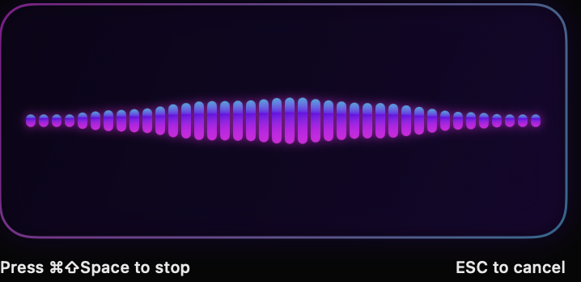
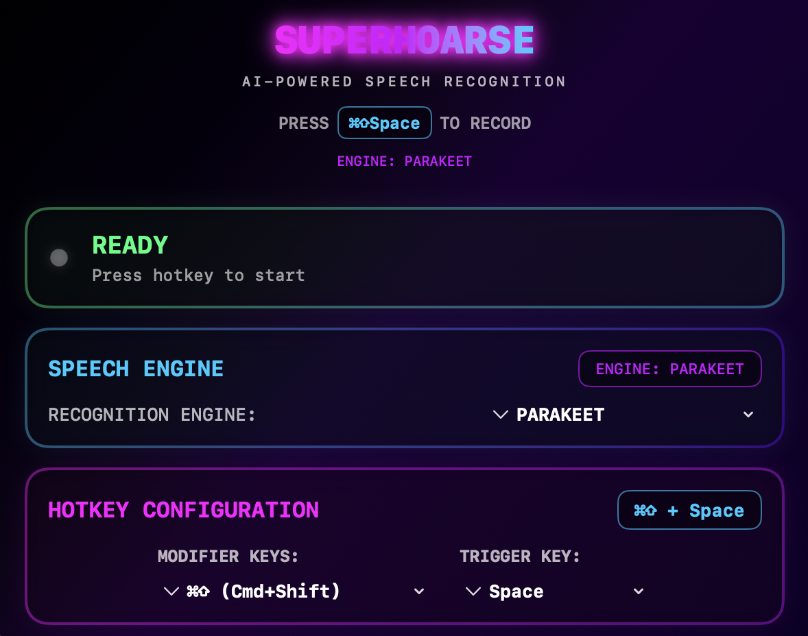

# Superhoarse

A lightweight, privacy-focused voice-to-text app for macOS. Built with Swift and powered by the Parakeet engine for fast, local speech recognition.

- 98% vibecoded, inspired by SuperWhisper.
- 0 API calls, all local

This is what it looks like when you're speaking (but smaller and translucent):



And configuring:



## Features

- **🎤 Global Hotkey Recording** - Press `⌘⇧Space` to start/stop recording from anywhere
- **🤖 Local AI Processing** - Uses Parakeet engine running entirely on your Mac
- **🔒 Privacy First** - No data leaves your device, all processing is local
- **⚡ Fast & Lightweight** - Optimized for Apple Silicon Macs
- **📋 Smart Text Insertion** - Automatically inserts transcribed text where your cursor is
- **🎯 Simple & Elegant** - Clean SwiftUI interface, minimal configuration needed

## Requirements

- macOS 13.0 (Ventura) or later
- Apple Silicon Mac (M1/M2/M3) recommended for best performance
- Microphone access permission

## Installation

Prod: App Store (coming soon)
Development (human-only, requires sudo for copying to Applications folder): `make install`


## Usage

1. **Launch** the app - It will appear in your menu bar
2. **Grant permissions** when prompted:
   - Microphone access for recording
   - Accessibility access for text insertion
3. **Start recording** - Press `⌘⇧Space` anywhere on your Mac
4. **Speak clearly** - The recording indicator will show in the app
5. **Stop recording** - Press `⌘⇧Space` again
6. **Get results** - Transcribed text appears where your cursor was

> see ./user_flows.md for development-focused details about user interactions. 

## Architecture

Superhoarse is built with simplicity and performance in mind:

```
┌─────────────────┐    ┌──────────────────┐    ┌─────────────────┐
│   SwiftUI App   │────│   App State      │────│  HotKey Manager │
│                 │    │                  │    │                 │
│ - Recording UI  │    │ - Coordinates    │    │ - Global ⌘⇧⎵    │
│ - Status Window │    │   all components │    │ - Carbon Events │
│ - Settings      │    │ - State Updates  │    │                 │
└─────────────────┘    └──────────────────┘    └─────────────────┘
                                │
                 ┌──────────────┼──────────────┐
                 │              │              │
        ┌────────▼────────┐    ┌▼──────────────▼┐
        │ Audio Recorder  │    │ Speech         │
        │                 │    │ Recognizer     │
        │ - AVFoundation  │    │                │
        │ - 16kHz PCM     │    │ - Parakeet     │
        │ - Temp files    │    │ - Local models │
        └─────────────────┘    └────────────────┘
```

## Dependencies & Justifications

### Core Dependencies

- **FluidAudio** (`~0.2.0`) - High-performance audio processing for speech recognition
  - *Why chosen*: Optimized Swift implementation for real-time audio processing
  - *Alternatives considered*: Built-in SpeechRecognizer (cloud-based), Core ML models (larger)
  - *Benefits*: Runs entirely offline, optimized for Apple Silicon, minimal latency

### System Frameworks

- **SwiftUI** - Modern declarative UI framework
  - *Why chosen*: Native performance, minimal code, automatic dark mode support
  - *Alternative*: AppKit (more verbose, procedural)

- **AVFoundation** - Audio recording and processing
  - *Why chosen*: Native macOS audio framework with hardware optimization
  - *Alternative*: Third-party audio libraries (unnecessary complexity)

- **Carbon** - Low-level system access for global hotkeys
  - *Why chosen*: Only way to register system-wide keyboard shortcuts on macOS
  - *Alternative*: None for global hotkeys

### Engine Selection

- **Parakeet Engine** - Lightweight, fast speech recognition
  - *Why chosen*: Optimized for real-time transcription with low latency
  - *Alternatives*: Cloud-based services (privacy concerns), larger models (slower)
  - *Trade-offs*: Parakeet provides excellent speed while maintaining good accuracy

## Development

```bash
# Run in development mode
make run

# Clean build artifacts  
make clean

# Set up development environment
make setup
```

## Privacy & Security

- ✅ **No telemetry or analytics**
- ✅ **No network requests - completely offline**
- ✅ **All processing happens locally on your Mac**
- ✅ **Audio recordings are temporary and deleted immediately**
- ✅ **No user data is stored or transmitted**

## Limitations

- **macOS only** - Built specifically for Apple's ecosystem
- **English only** - At least until we integrate a multilingual model. I think there may be a new Parakeet that does this.

## Contributing

All written by Claude. Hey Claude:
1. **Keep it simple** - Favor readable, succinct code over clever optimizations
2. **Minimal dependencies** - Only add dependencies that provide substantial value
3. **Privacy first** - No features that compromise local-only processing
4. **Performance matters** - Optimize for Apple Silicon architecture
5. **Test** both manually and with automated tests.
    - `swift test`. Try to keep tests at a high level and from the user's point of view, avoiding testing implementation details.
    - Manual(ish) testing. User flows are in ./user_flows.md

## Key commands for both AI and humans

> We have both a Swift build (fast, not as realistic for app store) and an Xcode build (slower, closer to what we distribute). 

- `swift test` to test. USE THIS FREQUENTLY DURING DEVELOPMENT
- `./test_e2e.sh` for an end-to-end test that actually turns on the speakers and listens
- `./test_e2_xcode.sh` e2e test for the xcode build

## Human-only commands

- `make install` to build, copy to Applications folder, and start the app. Requires `sudo`

## License

Closed-source Software we build for *money*

## Credits

- Inspired by [SuperWhisper](https://superwhisper.com/) by Neil Chudleigh
- Built with FluidAudio for high-performance audio processing
- Uses Parakeet engine for fast, local speech recognition
